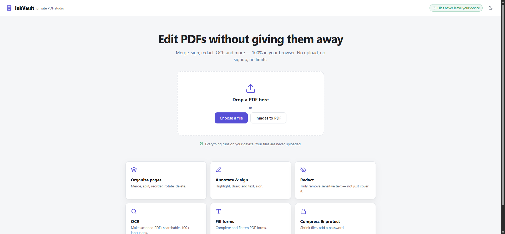
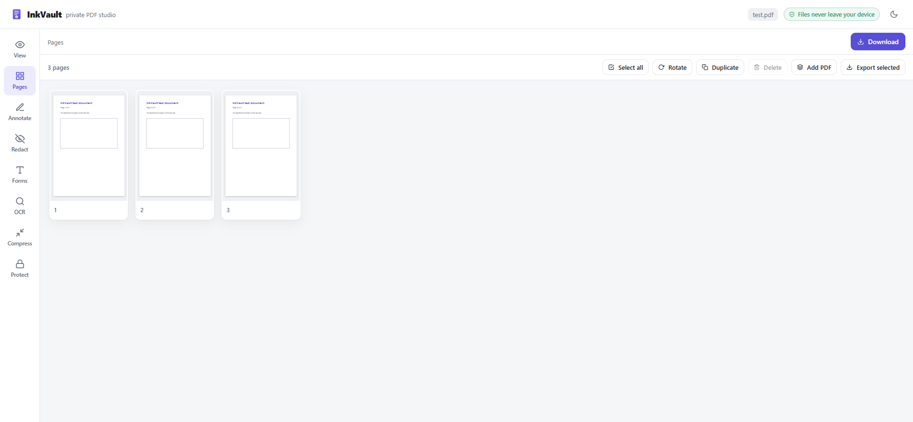
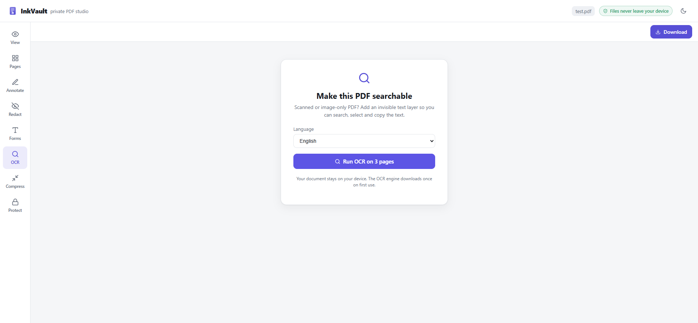
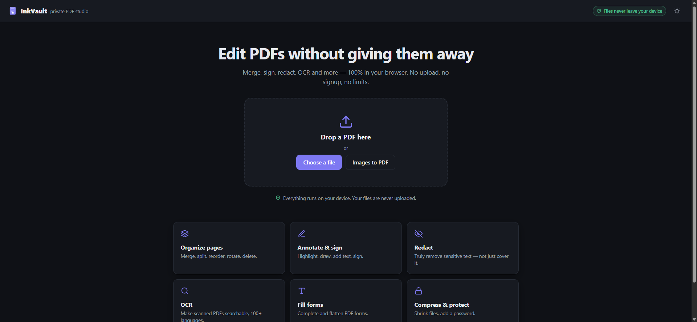

<div align="center">


# InkVault

**A private PDF studio that runs entirely in your browser.**

Merge, annotate, sign, redact, fill forms, OCR, compress and password-protect PDFs — without uploading a single byte. No account, no limits, no watermark.

### [→ Try it live at inkvaultpdf.pages.dev](https://inkvaultpdf.pages.dev)

[](https://inkvaultpdf.pages.dev)
&nbsp;
[](LICENSE)
&nbsp;·&nbsp; 100% client-side &nbsp;·&nbsp; No backend &nbsp;·&nbsp; Free forever

</div>

---

## Why

Most "free" PDF tools upload your file to a server, cap you after a few uses, stamp a watermark, or hide full-resolution output behind a subscription. Acrobat Pro costs $15–23/month. For anything sensitive — contracts, IDs, medical or financial documents — sending the file to someone else's server is the whole problem.

InkVault does the opposite: **every operation runs on your device.** Your file never leaves the browser tab. There is no server to upload to, nothing to sign up for, and no cap on how much you use it.

## Features

| | |
|---|---|
| **Organize** | Merge, split by range, reorder (drag & drop), rotate, delete, duplicate, reverse and insert blank pages. |
| **Annotate & sign** | Text (any language), highlighter, freehand pen, lines, arrows, rectangles, ellipses, whiteout, and signatures (draw, type or upload). |
| **Crop** | Draw a box to crop a page to that area. |
| **Redact** | Draw a box and the underlying content is **truly removed** on export — the page is flattened, not just covered with black. |
| **Fill forms** | Fill AcroForm fields (text, checkboxes, radios, dropdowns) then flatten them into the page. |
| **OCR** | Turn scanned or image-only PDFs into searchable, selectable text in 100+ languages. |
| **Stamp** | Add diagonal watermarks and page numbers (multiple formats and positions) across every page. |
| **Compress** | Shrink large or scanned PDFs with a quality dial and live before/after sizes. |
| **Protect** | Password-encrypt a PDF, or restrict printing/copying/editing. |
| **Details** | Edit document properties (title, author, subject, keywords). |
| **Images → PDF / Scan** | Drop images (JPG, PNG, WebP, GIF, BMP, AVIF, …) or capture pages from your camera to build a PDF. |
| **PDF → images / split** | Export pages as JPG/PNG, or split into one PDF per page — bundled as a zip. Extract or image single pages from their thumbnail. |
| **Compress images** | Shrink standalone JPG/PNG images right from the home screen. |
| **Extract text** | Save all selectable text (including OCR results) to a `.txt` file. |

Everything ends in a single **Download** that bakes your edits into a clean PDF, with full **undo/redo** (⌘/Ctrl+Z) along the way. Password-protected PDFs can also be opened for editing — InkVault asks for the password and unlocks them locally. It is a **PWA**: installable, and once loaded it works fully offline.

## Screenshots

| Home | Organize pages |
|---|---|
|  |  |

| OCR | Home (dark) |
|---|---|
|  |  |

## How it works

InkVault is a static single-page app. There is no backend, and no request ever carries your document.

- **[pdf.js](https://mozilla.github.io/pdf.js/)** renders pages to canvas for viewing and thumbnails.
- **[pdf-lib](https://pdf-lib.js.org/)** rebuilds the document on export — copying pages, applying rotation, and baking annotations, form values and redactions into real PDF content.
- **[tesseract.js](https://tesseract.projectnaptha.com/)** performs OCR on-device (the recognition engine downloads once from a public CDN; your document is never sent anywhere).
- **[@cantoo/pdf-lib](https://www.npmjs.com/package/@cantoo/pdf-lib)** adds the standard password encryption used by the Protect tool.

Annotations are stored as normalized coordinates and mapped onto the page at export time, accounting for each page's rotation, so what you see is what you get. See [docs/ARCHITECTURE.md](docs/ARCHITECTURE.md) for the full picture.

## Run locally

```bash
npm install
npm run dev      # start the dev server
npm run build    # production build to dist/
npm run preview  # preview the production build
```

Requires Node 18 or newer.

## Deploy

It is a static site, so any static host works. The included `netlify.toml` and `public/_redirects` set the single-page-app fallback so deep links resolve.

- **Cloudflare Pages / Netlify:** build command `npm run build`, output directory `dist`.
- **Any static host:** serve `dist/` and route unknown paths to `index.html`.

## Privacy

There is no analytics, no telemetry, and no network call that includes your file. The only outbound requests the app can make are for the OCR engine assets (tesseract.js) the first time you use OCR, and those are public, document-independent static files that are then cached for offline use. Everything else — parsing, editing, rendering, encryption — happens in your browser, and the whole app is precached to run offline.

## License

[MIT](LICENSE) © Chaganti Reddy
